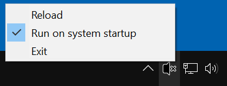
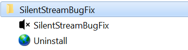

# SilentStreamBugFix
Fixes no short sounds and cut off in the beginning of sounds when using HDMI audio

## Installation

- Requirements: [.NET Framework 4.7+](http://go.microsoft.com/fwlink/?LinkId=863262)
- Download the [latest release](https://github.com/marcosbozzani/SilentStreamBugFix/releases/latest)
- Run *SilentStreamBugFix.exe*
- The program will be installed and started
- You may delete *SilentStreamBugFix.exe*

## About
The program runs in the system tray and by default starts with Windows.

If don't want the program starting with Windows, open the system tray menu by right-clicking the SilentStreamBugFix icon and then uncheck the "Run on system startup". If you think that the fix has stopped working, try the reload action from the same menu.

You can start the application manually or uninstall it from the Start Menu.

## Information about the bug
https://community.amd.com/thread/185767

https://forums.geforce.com/default/topic/518300/silent-stream-bug-fix-it-already-/

https://www.avsforum.com/forum/26-home-theater-computers/2427330-windows-10-return-no-silent-stream.html

https://blogs.msdn.microsoft.com/matthew_van_eerde/2008/12/10/sample-playing-silence-via-wasapi-event-driven-pull-mode/

## Acknowledgements
https://github.com/mvaneerde/blog/tree/master/silence

https://stackoverflow.com/a/4657392/386091

https://stackoverflow.com/a/9164742/386091

https://stackoverflow.com/a/25276441/25276418/

